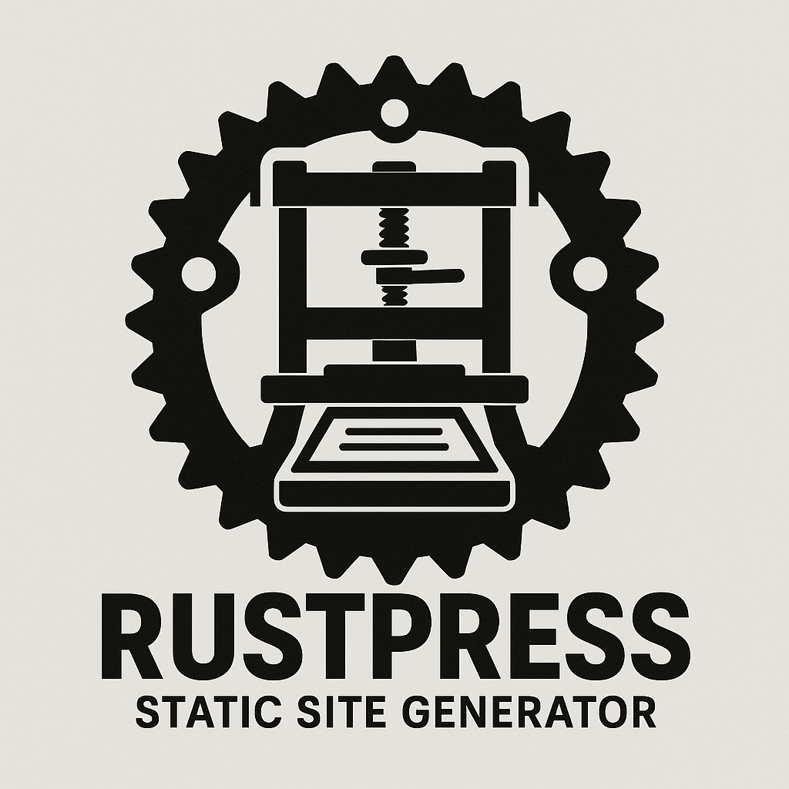

# Rustpress

<div align="center">

</div>
Rustpress is a flexible static site generator written in Rust, designed to convert Markdown content into static websites. It offers both CLI and WebAssembly (WASM) interfaces, with support for custom components, templates, and more.

## Features

- 📝 Markdown parsing with extended syntax
- 🧩 Custom component system
- 🎨 Templating with [Tera](https://tera.netlify.app/)
- 🌐 WebAssembly compatibility
- 📂 Directory-based content organization
- 🔌 Extensible architecture

## Installation

### From Source

```bash
# Clone the repository
git clone https://gitlab.com/hahihula/rustpress.git
cd rustpress

# Build the project
cargo build --release

# Install the CLI tool (optional)
cargo install --path rustpress-cli
```

## Usage

### CLI Tool

The Rustpress CLI provides two main commands: `convert` for single files and `build` for entire directories.

#### Convert a Single Markdown File

```bash
# Basic conversion
rustpress convert --input example.md --output example.html

# Using a custom template
rustpress convert --input example.md --output example.html --template my-template.html
```

#### Build a Site from a Directory

```bash
# Build a site
rustpress build --input content/ --output site/

# Build a site with a custom template
rustpress build --input content/ --output site/ --template templates/blog.html
```

### Custom Components

Rustpress supports two syntaxes for custom components:

#### HTML-like Syntax

```markdown
<Alert type="info" title="Information">
This is an informational alert.
</Alert>
```

#### Special Markdown Syntax

```markdown
:::alert{type="warning" title="Warning"}
This is a warning alert.
:::
```

### Built-in Components

Rustpress comes with several built-in components:

#### Alert

```markdown
<Alert type="info" title="Information">
This is an informational alert.
</Alert>
```

Types: `info`, `warning`, `error`

#### YouTube

```markdown
<YouTube id="dQw4w9WgXcQ" />
```

#### Tabs

```markdown
<Tabs>
## Tab 1
Content for tab 1

## Tab 2
Content for tab 2

## Tab 3
Content for tab 3
</Tabs>
```

### Frontmatter

You can add metadata to your Markdown files using YAML frontmatter:

```markdown
---
title: My Page Title
author: Jane Smith
date: 2023-05-01
tags: [rust, static-site, markdown]
---

# Content starts here
```

### Templates

Rustpress uses [Tera](https://tera.netlify.app/) for templating. Here's a basic template example:

```html
<!DOCTYPE html>
<html lang="en">
<head>
    <meta charset="UTF-8">
    <meta name="viewport" content="width=device-width, initial-scale=1.0">
    <title>{{ title }}</title>
    <style>
        body {
            font-family: system-ui, sans-serif;
            line-height: 1.6;
            max-width: 800px;
            margin: 0 auto;
            padding: 2rem;
        }
    </style>
</head>
<body>
    <main>
        {{ content | safe }}
    </main>
    <footer>
        
        <p>Written by {{ author }}</p>
        
    </footer>
</body>
</html>
```

### WebAssembly Usage

For browser usage, you can use the WASM build:

```html
<!DOCTYPE html>
<html>
<head>
    <title>Rustpress WASM Demo</title>
</head>
<body>
    <div id="output"></div>

    <script type="module">
        import init, { Rustpress } from './rustpress_wasm.js';

        async function run() {
            await init();
            const rustpress = new Rustpress();

            const markdown = `
# Hello from Rustpress

This is rendered using WebAssembly!

<Alert type="info" title="WebAssembly">
  Rustpress is running directly in your browser via WASM.
</Alert>
            `;

            const html = rustpress.render_markdown(markdown);
            document.getElementById('output').innerHTML = html;
        }

        run();
    </script>
</body>
</html>
```

## Project Structure

```
rustpress/
├── rustpress-core/      # Core library
├── rustpress-cli/       # CLI application
├── rustpress-wasm/      # WASM bindings
└── examples/            # Example projects
```

## Development

### Prerequisites

- Rust 1.70 or higher
- wasm-pack (for WASM development)

### Building

```bash
# Build everything
cargo build

# Build WASM package
cd rustpress-wasm
wasm-pack build --target web
```

### Running Tests

```bash
cargo test
```

## Future Plans

- Vue.js integration for themes
- Search index generation
- Plugin system
- Server-side rendering via Vite

## License

This project is licensed under the MIT License - see the LICENSE file for details.
